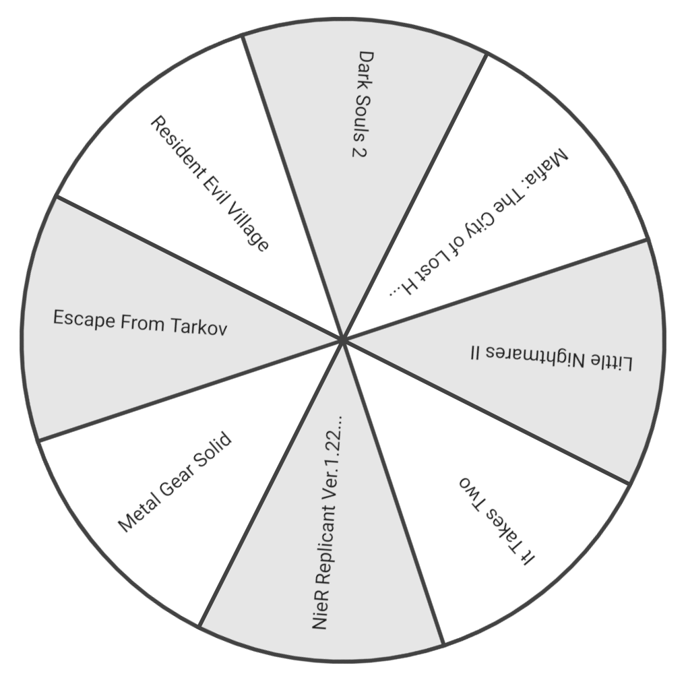

# React Spinning Canvas Wheel



## Features

- Zero dependencies
- Written in TypeScript
- High DPI screens support
- SSR support
- Customizable timing function

## Installation

```bash
npm i react-spinning-canvas-wheel
```

```bash
yarn add react-spinning-canvas-wheel
```

## Usage

```tsx
import { useRef } from 'react';
import SpinningWheel, {
  SpinningWheelRef,
  WheelSegment,
} from 'react-spinning-canvas-wheel';

const SEGMENTS: WheelSegment[] = [
  { title: 'Metal Gear Solid' },
  { title: 'Dark Souls 2' },
  { title: 'Escape From Tarkov' },
  { title: 'It Takes Two' },
  { title: 'Resident Evil Village' },
];

const Wheel = () => {
  const spinningWheelRef = useRef<SpinningWheelRef>();

  return (
    <div>
      {/* startSpinning(secondsToSpin: number, speed: number) */}
      <button onClick={() => spinningWheelRef.current.startSpinning(30, 4)}>
        Start
      </button>
      <button onClick={() => spinningWheelRef.current.stopSpinning()}>
        Stop
      </button>
      <SpinningWheel
        size={640}
        segments={SEGMENTS}
        spinningWheelRef={spinningWheelRef}
        onSegmentChange={(index) => console.log('currentSegmentIndex:', index)}
        onSpinStart={() => console.log('started')}
        onSpinEnd={(winnerIndex) => console.log('winnerIndex:', winnerIndex)}
      />
    </div>
  );
};
```
